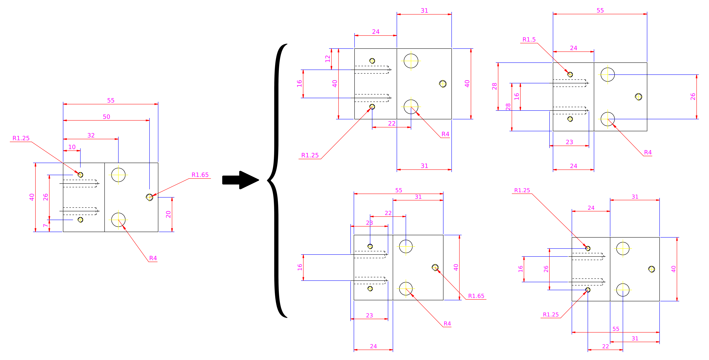

# Data Augmentation of Engineering Drawings for Data-driven Component Segmentation
Created by Wentai Zhang, Quan Chen, Can Koz, Liuyue Xie, Amit Regmi, Soji Yamakawa, Tomotake Furuhata, Kenji Shimada,Levent Burak Kara from Carnegie Mellon University.



### Abstract
We present a new data generation method to facilitate an automatic machine interpretation of 2D engineering part drawings. While such drawings are a common medium for clients to encode design and manufacturing requirements, a lack of computer support to automatically interpret these drawings necessitates part manufacturers to resort to laborious manual approaches for interpretation which, in turn, severely limits processing capacity.  Although recent advances in trainable computer vision methods may enable automatic machine interpretation, it remains challenging to apply such methods to engineering drawings due to a lack of labeled training data. As one step toward this challenge, we propose a constrained data synthesis method to  generate an arbitrarily large set of synthetic training drawings using only a handful of labeled examples. Our method is based on the randomization of the dimension sets subject to two major constraints to ensure the validity of the synthetic drawings. The effectiveness of our method is demonstrated in the context of a  binary component segmentation task with a proposed list of descriptors. An evaluation of several image segmentation methods trained on our synthetic dataset shows that our approach to new data generation can boost the segmentation accuracy and the generalizability of the machine learning models to unseen drawings.

### Dependencies
```
 dxfgrabber==1.0.1 
 ezdxf==0.11.1 
 matplotlib==3.1.1 
 multiprocess==0.70.9 
 numpy==1.17.2 
 pandas==0.25.3 
 python-dateutil==2.8.0 
 python-utils==2.3.0 
```